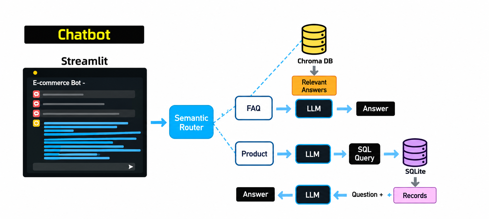
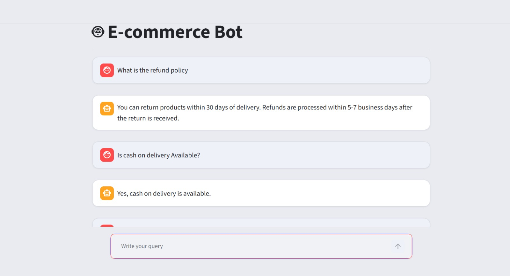
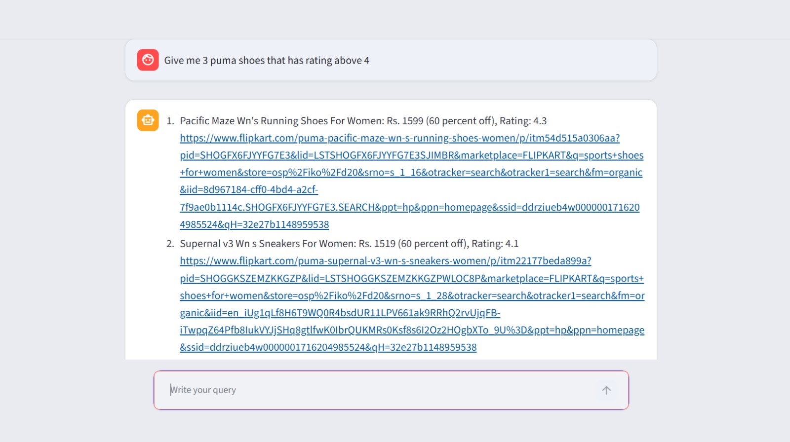

# 🤖 E-commerce Chat Bot

A conversational assistant for an e-commerce store. A semantic router classifies each message and hands it to one of two pipelines:

- **FAQ questions** (returns, payments, delivery) → answered via **RAG** over an FAQ knowledge base.
- **Product questions** ("Puma shoes under Rs. 3000, 4+ rating") → answered by **generating and running SQL** against a product database.

Built with **Streamlit**, **ChromaDB**, **semantic-router**, and **Groq**.

---

## Architecture



| Component | File | Responsibility |
|---|---|---|
| **Chat UI** | `main.py` | Streamlit chat interface + `ask()` dispatcher |
| **Router** | `router.py` | Classifies queries as `faq` or `sql` (`semantic-router` + HuggingFace encoder) |
| **FAQ chain** | `faq.py` | Embeds query → retrieves closest FAQs from **ChromaDB** → Groq answers from that context only |
| **SQL chain** | `sql.py` | Groq writes a `SELECT` query against the product schema → runs it on **SQLite** → Groq turns the rows into a readable reply |

## Workflow

**FAQ query** — answered via RAG over the FAQ knowledge base:



**Product query** — answered via generated SQL against the product database:



1. User sends a message in the chat UI.
2. `router()` embeds the query and matches it to the `faq` or `sql` route.
3. The matched chain builds a context-aware prompt and calls Groq.
4. For SQL queries, results are executed on SQLite and passed back through Groq for natural-language formatting.
5. The answer renders as a chat bubble and is saved to session state.

---

## Features

- 🧭 **Semantic routing** — intents defined as example utterances, matched by embedding similarity (`score_threshold` per route), no keyword matching.
- 📚 **RAG-based FAQ answering** — FAQ CSV is ingested into Chroma once on startup; a cosine-distance threshold filters out irrelevant matches so the bot can say *"I don't know"* instead of hallucinating.
- 🛒 **Text-to-SQL product search** — LLM is given the exact product schema, only `SELECT` statements are ever executed, and a second Groq pass turns raw rows into a numbered, human-readable list with price, discount, rating, and link.
- 💬 **Streamlit chat UI** with a custom theme and auto-scroll.
- 🔐 **Env-based config** via `python-dotenv` — no secrets in code.

---

## Tech Stack

Streamlit · semantic-router · HuggingFace encoders (`all-MiniLM-L6-v2`) · ChromaDB · Groq · SQLite · pandas · python-dotenv

---

## Getting Started

```bash
git clone <your-repo-url>
cd project-ecommerce-tool

python -m venv .venv
source .venv/bin/activate        # Windows: .venv\Scripts\activate

pip install streamlit pandas chromadb sentence-transformers groq \
            python-dotenv semantic-router huggingface-hub
```

Create a `.env` file in the project root:

```env
GROQ_API_KEY=your_groq_api_key
GROQ_MODEL=openai/gpt-oss-20b
HF_TOKEN=your_huggingface_token
```

Make sure `app/resources/faq_data.csv` has `question`/`answer` columns, and `app/db.sqlite` has a `product` table (`product_link`, `title`, `brand`, `price`, `discount`, `avg_rating`, `total_ratings`).

Run it:

```bash
streamlit run app/main.py
```

On first launch, the FAQ CSV is embedded into a Chroma collection; later runs reuse it.

---

## Tuning Notes

- **`DISTANCE_THRESHOLD`** (`faq.py`) — lower it to cut false-positive FAQ matches, raise it if the bot says *"I don't know"* too often. Use `faq_chain(query, debug=True)` to print distances.
- **`score_threshold`** (`router.py`) — controls how confidently a query must match a route before it's selected; add more example utterances to improve edge-case routing.
- SQLite doesn't support `ILIKE`, so `sql.py` enforces `LIKE` for case-insensitive brand matching.